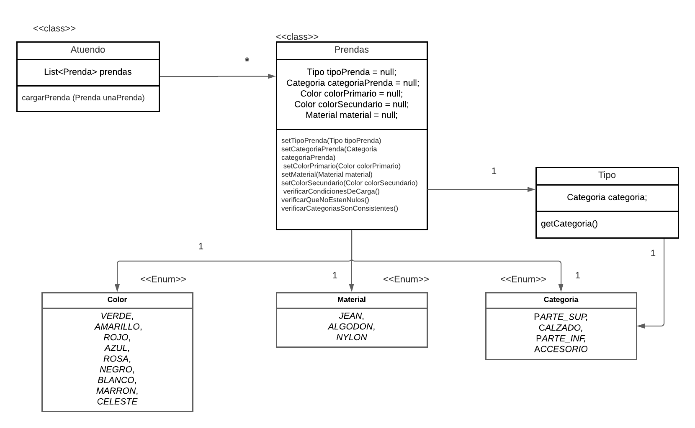

# QueMePongo

Decisiones de diseño:

Los colores y materiales los pensé como enum porque no es algo que pueda ir "variando", una vez que una
prenda es de determinado color o material, va a quedar de esa forma, no es necesario crear un objeto (al menos hasta ahora) que
tenga la capacidad de ir variando estas características

ELEGÍ los setters en vez de constructores porque me parece que sería una mejor opción dado que
cabe la posibilidad de que el usuario no ingrese uno de dichos valores (son los que los atajaría la excepción
de que falta completar algo - como se requiere en el enunciado). Si lo pongo en constructor, estoy obligando
a que se completen cuando no es lo que yo necesito. Creería que si lo hago con constructores, si se quisiera dejar algo incompleto 
debería pasarle null como parámetro, lo solucioné inicializando todo el null ¿?

El tipo de la prenda me va a dar la categoría que luego se verifica

La verificación de si una prenda es correcta par agregar la puse en Atuendo pero porque no sé si hay que tener una entidad de usuario
que haga esto, entonces me parecía que lo más "logico" era poner ese comportamiento en autuendo. 

Diagrama para la primera iteración 

